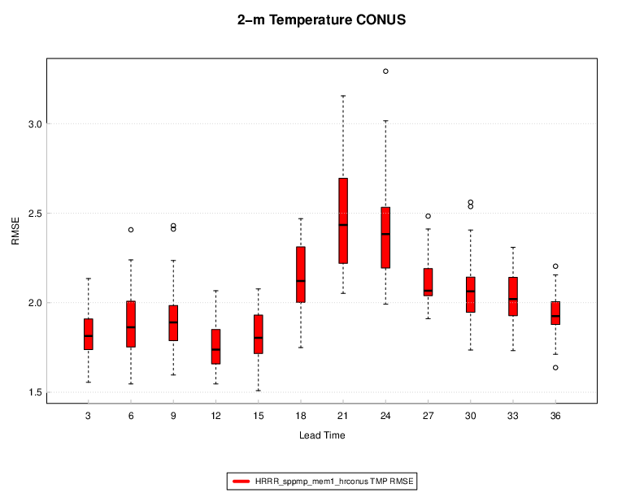

Box Plots
=========

Description
-----------

Box plots, or box and whisker plots, are a way to summarize a distribution of values using Tukey's 5-number summary (Hoaglin et al., 1983). The dark line in the middle of the boxes (sometimes called the 'waist') is the median of data. Half of the data values have a value greater than the median, and half have a value lower. The actual box (i.e. the central rectangle) spans the first quartile to the third quartile (or the interquartile range or IQR). Whiskers extend to 1.5 times the height of the box or, if closer to the median, the minimum or maximum values of the data. The points represent outliers: any data point more than 1.5 times the IQR away from the median. These are defined as values that do not fall inside the whiskers. Outliers are extreme values.

Box plots work best for comparing a set of continuous values (e.g. some verification statistic) conditionally for a set of discrete categories. The example below shows RMSE (root-mean-squared-error; a continuous measure of forecast quality) for each of several distinct lead times. Other examples could be probability of detection (POD) or Gilbert Skill Score (GSS) across a set of models for a specific precipitation threshold. Here, each forecast and observation is binary, but the verification statistic is continuous. 

How-To
---------

Selection of options to produce the plot proceeds approximately counter-clockwise around the METviewer window. The steps to create a series plot are:

#. Select the desired database from the “Select databases” pulldown menu at the top margin of the METviewer window.

#. There are a number of tabs just under the database pulldown menu. Select the ‘Box’ tab.

#. Select the type of MET statistics that will be used to create the box plot. Click on the “Plot Data” pulldown menu which is located under the tabs. The list contains “Stat”, “MODE”, or “MODE-TD”. For details about these types of output statistics in MET, please see the most recent version of the `MET User's Guide <https://dtcenter.org/community-code/model-evaluation-tools-met/documentation>`_.

#. Select the desired variable to calculate statistics for in the “Y1 Axis Variables” tab. The first pulldown menu in the “Y1 Dependent (Forecast) Variables” section lists the variables available in the selected dataset.

#. Select the desired statistic to calculate in the second pulldown menu which is to the right of variable menu. This lists the available attribute statistics the selected dataset. Multiple statistics can be selected and they will each be plotted as separate boxes on the plot.

#. Select the Y1 Series Variable from the first pulldown menu in that section. There are many options. “MODEL” is used in the included example. In the second pulldown menu to the right of the first are the series variable options, for example, different models.

#. It usually does not make sense to mix statistics for different groups. The desired group to calculate statistics over can be specified using the “Fixed Values” section. In the example below, a single domain (category: "VX_MASK", value: "CONUS") and a single level (category: "FCST_LEV", value: "Z2") are chosen. If multiple domains or thresholds were chosen, the statistics would be a summary of all of those cases together, which may not always be desired.

#. Select the x-axis value in the “Independent Variable” dropdown menu. For a box plot, this is often a date, lead time, or threshold. In the example in the next section, the Y1 dependent variable “RMSE” is plotted for the ensemble member selected in “Y1 Series Variable” and is plotted over forecast lead time.

#. Select the type of statistics summary by selecting either “Summary” or “Aggregation Statistics” button in the “Statistics” section. Aggregated statistics may be selected for certain varieties of statistics. The selection can be made from the leftmost dropdown menu in the “Statistics” section. By default, the median value of all statistics will be plotted. Using the dropdown menu, the mean or sum may be selected instead. Choosing this option will cause a single statistic to be calculated from the individual database lines.

#. There is a "Plot Configurations" that has options specific to box plots, including whether or not to show outliers, points, notches, and more. The box width can also be altered here. 
    
#. Now enough information has been entered to produce a graph. To do this, click the “Generate Plot” button at the top of the METviewer window (this is in red text). Typically, if a plot is not produced, it is because the database selected does not contain the correct type of data. Also, it is imperative to check the data used for the plot by selecting the “R data” tab on the righthand side, above the plot area. The data from the database that is being used to calculate the statistics is listed in this tab. This tab should be checked to avoid the accidental accumulation of inappropriate database lines. For example, it does not make sense to accumulate statistics over different domains, thresholds, models, etc.

There are many other options for plots, but these are the basics.

Example
--------

The example below shows a boxplot of the RMSE for 2m temperature over the CONUS. Many of the standard METviewer plotting options are available for the boxplot.

	    Figure 5.1: Example Boxplot created by METviewer for RMSE of 2m temperature over the CONUS by lead time.

Here is the associated xml for this example. It can be copied into an empty file and saved to the desktop then uploaded into the system by clicking on the “Load XML” button in the upper-right corner of the GUI. This XML can be downloaded by visiting GitHub here ??[insert link to XML]??.

.. literalinclude:: xml/boxplots_xml.xml
