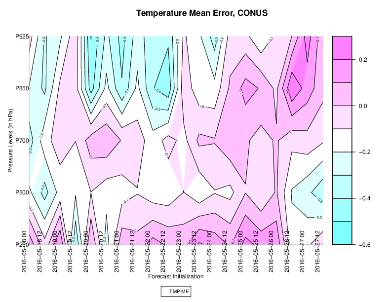

Contour Plots
=============

Description
-----------

Contour plots are a very general plot type somewhat similar to a scatter plot. The axes are specified by the user, and any will do so long as the entire set of x and y locations has some value (i.e. not missing data). The value is then contoured. This type of plot is often used to examine statistics over a series of time or heights. Often, it can be desirable to examine the difference in statistics between two NWP models as a contour plot, as is shown in the example below. 

How-To
-------

Selection of options to produce the plot proceeds approximately counter-clockwise around the METviewer window. The steps to create a contour plot are:

#. Select the desired database from the “Select databases” pulldown menu at the top margin of the METviewer window.

#. There are a number of tabs just under the database pulldown menu. Select the ‘Contour’ tab, which is the rightmost tab.

#. Select the desired variable to calculate statistics for in the “Variable and Statistic” tab. The first pulldown menu lists the variables available in the selected database.

#. Select the desired statistic to calculate in the second pulldown menu which is to the right of variable menu. This lists the available attribute statistics in the selected dataset.

#. Select the Y axis Independent Variable from the first pulldown menu in the section of the same name. There are many options. “FCST_LEV” is used in the included example. In the second pulldown menu to the right of the first are the independent variable options.

#. It usually does not make sense to mix statistics for different groups. The desired group to calculate statistics over can be specified using the “Fixed Values” section. In the example below, a single domain (category: “VX_MASK”, value: “CONUS”) and a model (category: “MODEL”, value: “HRRR_hrconus”) are chosen. If multiple domains or threshold were chosen, the statistics would be a summary of all of those cases together, which may not always be desired.

#. Select the x-axis value in the “X axis Independent Variable” section. For this example, it is the forecast initialization beginning time.

#. The "Configurations" section contains various options for the contour plot including the color scheme and contour line overlay. 

#. Select the type of statistics summary by selecting either “Summary” or “Aggregation Statistics” button in the “Statistics” section. Aggregated statistics may be selected for certain varieties of statistics. The selection can be made from the leftmost dropdown menu in the “Statistics” section. By default, the median value of all statistics will be plotted. Using the dropdown menu, the mean or sum may be selected instead. Choosing this option will cause a single statistic to be calculated from the individual database lines. 

#. Now enough information has been entered to produce a graph. To do this, click the “Generate Plot” button at the top of the METviewer window (this is in red text). Typically, if a plot is not produced, it is because the database selected does not contain the correct type of data. Also, it is imperative to check the data used for the plot by selecting the “R data” tab on the righthand side, above the plot area. The data from the database that is being used to calculate the statistics is listed in this tab. This tab should be checked to avoid the accidental accumulation of inappropriate database lines. For example, it does not make sense to accumulate statistics over different domains, thresholds, models, etc.

There are many other options for plots, but these are the basics.

Example
--------

The example is a contour plot of temperature mean error (bias) for one model at different pressure levels over a range of initialization times.

	    Figure 10.1:  Example METviewer contour plot showing temperature bias by pressure level over a series of initialization times.

Here is the associated xml for this example. It can be copied into an empty file and saved to the desktop then uploaded into the system by clicking on the “Load XML” button in the upper-right corner of the GUI. This XML can be downloaded by visiting GitHub here ??[insert link to XML]??.

.. literalinclude:: xml/contour_xml.xml
