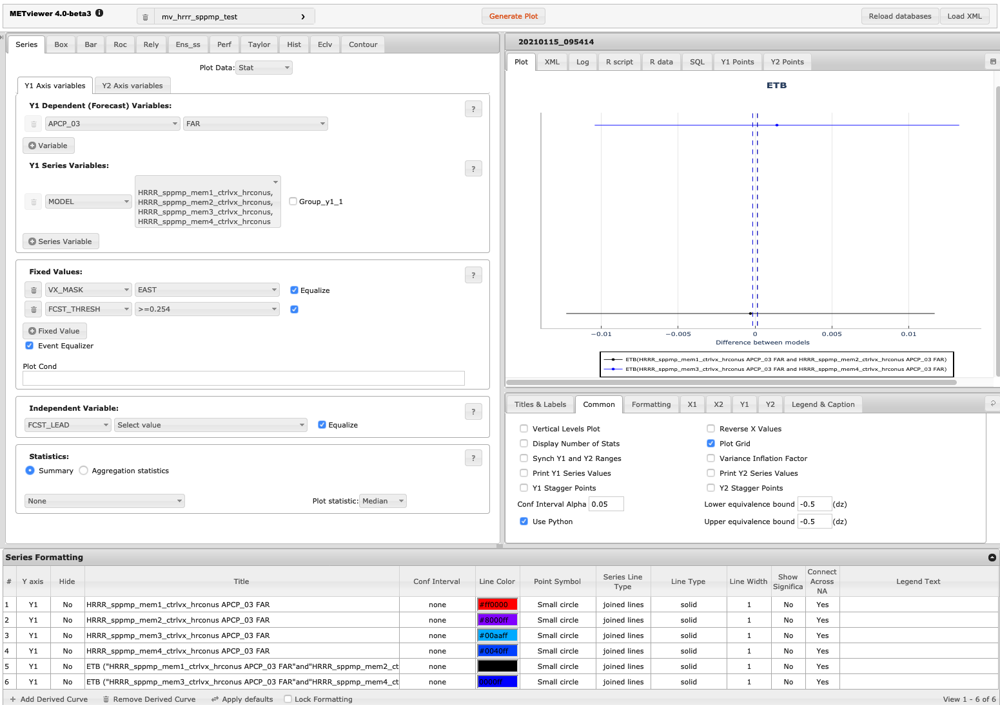

Equivalence Testing Bounds Plots
============

Description
-----------

A statistical hypothesis is an assertion about the distribution function for one or more random variables.
Generally, two hypotheses are considered, a null hypothesis denoted by H0, and an alternative denoted by
either H1 or sometimes Ha. Most often H0 is a statement about the absence of an effect, e.g.,
no difference between two means.  However, it is not required to specify the absence of an effect,
and some hypothesis tests are constructed such that the null hypothesis is that there is an effect.
Two types of errors can occur in this setting: a type I error happens when H0 is rejected but it
is actually true, and a type II error occurs when it is not rejected even though it is false.
Most often, a type I error is considered the more serious error, so tests are constructed a priori
to control for this type of error. Power is the probability of rejecting the null hypothesis when
it is false (i.e., the probability of not making a type II error). If the power is close to 1,
the hypothesis test is good at detecting a false null hypothesis. Power is increased when a researcher
increases sample size, as well as when a researcher selects stronger effect sizes and significance levels.
An equivalence test is where H0 specifies that there is a difference, or that there is an effect.
For example, that the difference between two means is not zero. In model validation, equivalence
tests can help address the question of “Does the same code produce equivalent output using different
computers, compilers, and/or input data?” In the equivalence testing framework, two one-sided tests
are often used (Mara and Cribbie 2012). Two one-sided tests for paired data require a user-defined margin,
or equivalence interval, within which the samples are considered equivalent.
The choice of the equivalence interval is based on practical considerations and the research
questions being addressed; in addition, the equivalence interval need not be symmetric.
For a conclusive result, both one-sided tests must be rejected, concluding the difference of the
means falls within the upper and lower equivalence bounds.

MET employs CI's along with the user-defined tolerance bounds, which can be used to employ an equivalence test.
In this case, H0 is accepted if the CI bounds fall completely between the tolerance bounds,
and H0 is rejected otherwise.

How-To
-------

Selection of options to produce the plot proceeds approximately
counter-clockwise around the METviewer window. The steps to create a
series plot are:

#. Select the desired database from the "Select databases" pulldown menu
   at the top margin of the METviewer window.

#. There are a number of tabs just under the database pulldown menu.
   Select the 'Series' tab, which is the leftmost tab.

#. Select the type of MET statistics that will be used to create the
   series plot. Click on the “Plot Data” pulldown menu which is located
   under the tabs. The list contains “Stat”, “MODE”, or “MODE-TD”.
   Select “Stat”.

#. Select the desired variable to calculate statistics for in the
   "Y1 Axis Variables" tab. The first pulldown menu in the
   "Y Dependent (Forecast) Variables" section lists the variables
   available in the selected database.

#. Select the desired statistic to calculate in the second pulldown menu
   which is to the right of the variable menu. This lists the available
   attribute statistics in the selected dataset. Multiple statistics
   can be selected and they will each be plotted as a separate line on
   the plot.

#. Select the Y1 Series Variable from the first pulldown menu in that
   section. There are many options. "MODEL" is used in the included
   example. In the second pulldown menu to the right of the first are
   the series variable options, for example, different models.
   For this plot at least two values of the Series Variable is needed.

#. Groups are nor supported for this plot type.

#. "Independent Variable" is optional and will be used as "Fixed Variable".

#. Select the type of statistics summary by selecting either "Summary"
   or "Aggregation Statistics" button in the “Statistics” section.
   Aggregated statistics may be selected for certain varieties of
   statistics. The selection can be made from the leftmost dropdown
   menu in the "Statistics" section. By default, the median value of
   all statistics will be plotted. Using the dropdown menu, the mean or
   sum may be selected instead. Choosing this option will cause a
   single statistic to be calculated from the individual database lines.

#. Select Lower and Upper equivalence bounds in the Common section.
   The default values are -0.001 and 0.001

#. Create ETB derived curve by opening a pop-up menu with 'Add Derived Curve"
   button in the bottom of the 'Series Formatting" table. Select curves of interest
   and check 'Equivalence Testing Bounds" radio button. Since the data for both
   curves should be similar, the event equalisation is enforced.

#. Now enough information has been entered to produce a graph. To do this,
   click the "Generate Plot" button at the top of the METviewer window
   (this is in red text). Typically, if a plot is not produced, it is
   because the database selected does not contain the correct type of
   data or the data is not similar. Also, it is imperative to check the
   data used for the plot by
   selecting the "R data" tab on the right hand side, above the plot
   area. The data from the database that is being used to calculate the
   statistics is listed in this tab. This tab should be checked to avoid
   the accidental accumulation of inappropriate database lines. For
   example, it does not make sense to accumulate statistics over
   different domains, thresholds, models, etc.

There are many other options for plots, but these are the basics.

Example
--------

The image below shows an example of the plot and set-up options for a
series plot in METviewer. This example uses the database
“mv_hrrr_sppmp_test” to plot “Stat” output for seven ensemble members.
The Frequency bias over the East domain is plotted for 3-hour
precipitation accumulation exceeding 0.254 cm. Appropriate titles and
labels have been entered in the titles and labels tab shown below
the plot. Colors and line formatting are shown across the bottom menu
of the plot. The values here are the defaults.

	    Screen capture of METviewer configured to produce
	    a ETB plot.

Here is the associated xml for this example. It can be copied into an
empty file and saved to the desktop then uploaded into the system by
clicking on the "Load XML" button in the upper-right corner of the GUI.
This XML can be downloaded from this link:
`etb_plot_xml.xml <https://dtcenter.github.io/METviewer/latest/_static/xml/etb_plot_xml.xml>`_.

.. literalinclude:: ../_static/xml/etb_plot_xml.xml

