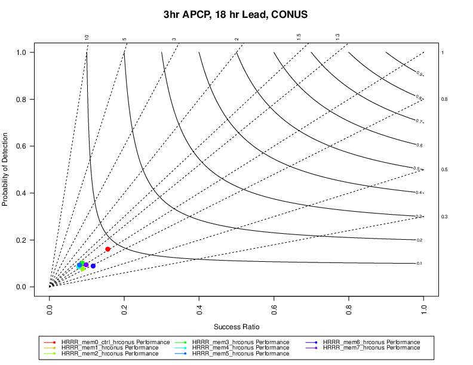

Performance Diagrams
====================

Description
-----------

Performance diagrams are used to show the relationship between categorical statistics, with axes representing detection and success (1 - false alarm) rates (Roebber, 2009). Frequency bias and the critical success index (CSI) are also shown on the diagram. The simplest input to the performance diagram is the MET contingency table statistics (CTS) output. This output can be produced by many of the MET tools (Point-Stat, Grid-Stat, etc.). In METviewer, contingency tables can be accumulated over some time period but kept separate for different models, lead times, observation sources, domains, etc. 

There are several reference lines on the performance diagram. The dashed lines that radiate from the origin are lines of equal frequency bias. Labels for the frequency bias amount are at the end of each line in the margins. The diagonal represents a perfect frequency bias score of 1. Curves of equal Critical Success Index (CSI) connect the top of the plot to the right side. CSI amounts are listed to the right side of the plot, with better values falling closer to the top.

Line Type
---------
Performance requires categorical statistics generated by either Point-Stat or Grid-Stat. These are:

* CTC
* NBRCTC
* CTS

How-To
-------

Selection of options to produce the reliability diagram proceeds approximately counter-clockwise around the METviewer window.

#. Select the desired database from the “Select databases” pulldown menu at the top margin of the METviewer window.

#. There are a number of tabs just under the database pulldown menu. Select the ‘Perf’ tab.

#. Select the desired series variable to calculate 
for in the “Series Variables” tab. Press the “+ Series Variable” button to reveal two pulldown menus. The first pulldown menu in the lists the categories available in the selected dataset. The second pulldown menu allows you to select the value of that category.

#. It usually does not make sense to mix statistics for different groups. The desired group to calculate statistics over can be specified in the “Fixed Values” section. For a performance diagram, the forecast variable (“FCST_VAR”) must be selected. In the example below, the forecast variable is “APCP_03”. A single domain (category: “VX_MASK”, value: “CONUS”) is chosen. If multiple domains or thresholds were chosen, the statistics would be a summary of all of those cases together, which may not always be desired.

#. Select the independent variable in the "Independent Variable" section. 

#. Select the type of statistics summary by selecting either “Summary” or “Aggregation Statistics” button in the “Statistics” section. Aggregated statistics may be selected for certain varieties of statistics. The selection can be made from the leftmost dropdown menu in the “Statistics” section. By default, the median value of all statistics will be plotted. Using the dropdown menu, the mean or sum may be selected instead. Choosing this option will cause a single statistic to be calculated from the individual database lines.

#. Now enough information has been entered to produce a graph. To do this, click the “Generate Plot” button at the top of the METviewer window (this is in red text). Typically, if a plot is not produced, it is because the database selected does not contain the correct type of data. Also, it is imperative to check the data used for the plot by selecting the “R data” tab on the righthand side, above the plot area. The data from the database that is being used to calculate the statistics is listed in this tab. This tab should be checked to avoid the accidental accumulation of inappropriate database lines. For example, it does not make sense to accumulate statistics over different domains, thresholds, models, etc.

There are many other options for plots, but these are the basics. 

Example
--------
 
The reliability diagram shown below is for 3 hour accumulated precipitation over the CONUS for 8 ensemble members at the 18 hour forecast lead time. In the figure, the ensemble members fall closer to the lower left area of the diagram, indicating that the ensemble has a low performance for forecasting 3-hr accumulated precipitation at the 18 hour forecast lead time.  

	    Figure 8.1 Example performance diagram.

Here is the associated xml for this example. It can be copied into an empty file and saved to the desktop then uploaded into the system by clicking on the “Load XML” button in the upper-right corner of the GUI. This XML can be downloaded by visiting GitHub here ??[insert link to XML]??.

.. literalinclude:: xml/perfdiag_xml.xml  
