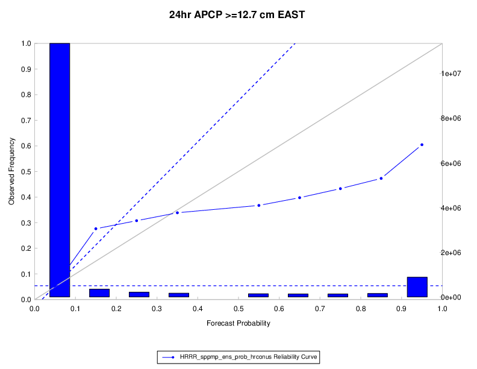

Reliability Plots
=================

Description
-----------

Reliability (or attributes) diagrams are used to show the conditional bias of probabilistic forecasts. If a probability forecast is reliable, then the relative frequency of events for a certain category of probability forecasts will be approximately the same as the forecast probability. In other words, when a 50% probability of precipitation is forecast, approximately half of the corresponding observations should indicate that precipitation fell. 

The reliability diagram groups the forecasts into bins according to the issued probability (x axis). The frequency with which the event was observed to occur for this sub-group of forecasts is then plotted against the y axis. For perfect reliability the forecast probability and the frequency of occurrence should be equal, and the plotted points should lie on the diagonal (by default a solid grey line in the example figure below). In other words, when a 50% probability of precipitation is forecast, approximately half of the corresponding observations should indicate that precipitation fell.

Reliability diagrams can be used to make adjustments to the conditional bias of the forecast probabilities.

Line Type
---------
Reliability diagrams require the probability statistics (PCT line type) generated by either Point-Stat or Grid-Stat.

How-To
-------

Selection of options to produce the reliability diagram proceeds approximately counter-clockwise around the METviewer window.

#. Select the desired database from the “Select databases” pulldown menu at the top margin of the METviewer window.
   
#. There are a number of tabs just under the database pulldown menu. Select the ‘Rely’ tab.

#. Select the desired series variable to calculate statistics for in the “Series Variables” tab. Press the “+ Series Variable” button to reveal two pulldown menus. The first pulldown menu in the lists the categories available in the selected dataset. The second pulldown menu allows you to select the value of that category. The reliability diagram only makes sense for probability forecasts. These can be from ensemble forecasts or from a traditional forecast. 

#. It usually does not make sense to mix statistics for different groups. The desired group to calculate statistics over can be specified in the “Specialized Plot Fixed Values” section. For a reliability diagram, the forecast variable (“FCST_VAR”) must be selected. In the example below, the forecast variable is “APCP_24_ENS_FREQ_gt12.700”. A single domain (category: “VX_MASK”, value: “EAST”) is chosen. If multiple domains or threshold were chosen, the statistics would be a summary of all of those cases together, which may not always be desired.

#. Choose whether or not to display the reliability event histogram in the "Reliability Event Histogram" section. Event histograms allow the user to see how often the forecast falls within each probability bin. The sample sizes in each bin are typically different, and some may be too small for conclusions. They also allow the user to judge the sharpness of the forecasts.

#. There are two checkboxes in the "Reliability Event Histogram" section. 
   
   * Skill line: The skill, or reliability, of a forecast is indicated by the proximity of the plotted curve to the diagonal skill line. The deviation from the diagonal gives the conditional bias. If the curve lies below the line, this indicates over-forecasting (probabilities too high); points above the line indicate under-forecasting (probabilities too low).
  
   * Reference line: This line (typically dashed) denotes the sample climatology or base rate, the frequency of the event.

#. Select what summary curve to display (if any) in the "Summary Curve" section.

#. Adjust the aggregation options, if desired, in the "Aggregation options" section.

#. Now enough information has been entered to produce a graph. To do this, click the “Generate Plot” button at the top of the METviewer window (this is in red text). Typically, if a plot is not produced, it is because the database selected does not contain the correct type of data. Also, it is imperative to check the data used for the plot by selecting the “R data” tab on the righthand side, above the plot area. The data from the database that is being used to calculate the statistics is listed in this tab. This tab should be checked to avoid the accidental accumulation of inappropriate database lines. For example, it does not make sense to accumulate statistics over different domains, thresholds, models, etc.

There are many other options for plots, but these are the basics.

Example
--------

The reliability diagram shown below is for the probability of 24 hour precipitation with accumulations greater than or equal to 12.7 cm occurring over the eastern CONUS. In the figure the reliability curve has a positive slope, indicating that as the forecast probability of the event occurring increases, so does the likelihood of observing the event. The forecasts therefore have some reliability. However, the slope is much less than the diagonal, indicating conditional bias or a lack of reliability. In this example, when forecast probability of precipitation is equal to 55% the actual chance of observing the event is closer to 35%.

The histogram shows the relative frequency with which the event has been predicted (typically over the reference period and at all gridpoints) with different levels of probability. In the example, the majority of forecasts predict low probabilities of precipitation (near the climatological probability of ~5%). The forecast system is also capable of predicting relatively high probabilities of the event (e.g. greater than 40%), but such forecasts are less common.

	    Figure 7.1 Example reliability (attributes diagram) with histogram of observation counts and bootstrap confidence intervals.

Here is the associated xml for this example. It can be copied into an empty file and saved to the desktop then uploaded into the system by clicking on the “Load XML” button in the upper-right corner of the GUI. This XML can be downloaded by visiting GitHub here ??[insert link to XML]??.

.. literalinclude:: xml/reliability_xml.xml 
