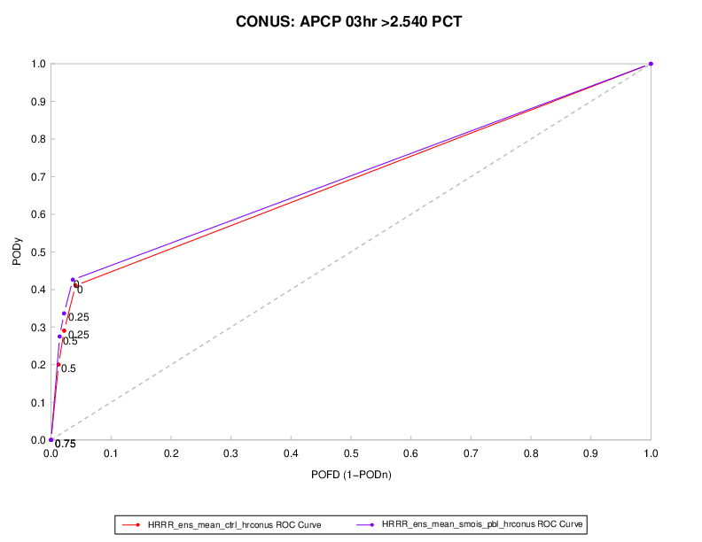

Receiver Operating Characteristic (ROC) Plots
==============================================

Description
-----------

MET produces hit rate (Probability of Detection; POD) and Probability of False Detection (POFD) values for each user-specified threshold of a forecast or from each category of a probabilistic forecast. This information can be used to create a scatter plot of POFD vs. POD. When the points are connected, the plot is generally referred to as the Receiver Operating Characteristic (ROC) curve (also called the "Relative Operating Characteristic" curve). An ROC plot is shown for an example set of forecasts, with a solid line connecting the points for six user specified thresholds. The diagonal dashed line indicates no skill, while the dash-dot line shows the ROC for a perfect forecast. An ROC curve shows how well the forecast discriminates between two outcomes, so it is a measure of resolution. The ROC is invariant to linear transformations of the forecast and is thus unaffected by bias. An unbiased (i.e., well-calibrated) forecast can have the same ROC as a biased forecast, though most would agree that an unbiased forecast is "better". Since the ROC is conditioned on the observations, it is often paired with the reliability diagram, which is conditioned on the forecasts.

Line Type
---------
ROC requires probability statistics generated by either Point-Stat or Grid-Stat. These line types are:

* PRC
* PCT
* CTC

How-To
-------

Selection of options to produce the ROC plot proceeds approximately counter-clockwise around the METviewer window. 

#. Select the desired database from the “Select databases” pulldown menu at the top margin of the METviewer window.

#. There are a number of tabs just under the database pulldown menu. Select the ‘Roc’ tab.

#. “Stat” is the only acceptable statistic type for a ROC plot as this type of diagram can only use information from the CTC and PCT line types available in the “Stat” output. For details about these types of statistics from MET, please see the most recent version of the `MET User's Guide <https://dtcenter.org/community-code/model-evaluation-tools-met/documentation>`_.

#. Select the desired series variable to calculate statistics for in the “Series Variables” tab. Press the "+ Series Variable" button to reveal two pulldown menus. The first pulldown menu lists the categories available in the selected dataset. The second pulldown menu allows you to select the value of that category. 

#. It usually does not make sense to mix statistics for different groups. The desired group to calculate statistics over can be specified in the “Specialized Plot Fixed Values” section. For a ROC plot, the forecast variable ("FCST_VAR") must be selected. In the example below, the forecast variable is "APCP_03_ENS_FREQ_gt2.540". A single domain (category: “VX_MASK”, value: “CONUS”) is chosen. If multiple domains or thresholds were chosen, the statistics would be a summary of all of those cases together, which may not always be desired.

#. Select the desired method of ROC calculation in the "ROC Calculations" section. This can be done in one of two ways. In both cases, the observation threshold must be identical for all points on the plot. Otherwise, this is not an ROC plot at all.

        * PCT: The most common way to product an ROC plot is using the Nx2 Probabilistic Contingency Table (PCT) counts from the PCT line in MET. MET can also write out the PSTD line type which includes the ROC_AUC column: a number between 0 and 1 indicating the area under the ROC curve, with 1 being the best. MET calculates this value and it gets loaded into METviewer. METviewer can plot the ROC_AUC value but it does not compute it.

        * CTC: The less common way of generating a ROC curve is using several 2x2 contingency table lines. This would be the FHO or CTC line types from MET. They need to be multiple forecast thresholds all computed for the *same* observation threshold. However, METviewer does not currently compute the area under the ROC curve, thus there is no way for METviewer to plot that statistic.

#. Now enough information has been entered to produce a graph. To do this, click the “Generate Plot” button at the top of the METviewer window (this is in red text). Typically, if a plot is not produced, it is because the database selected does not contain the correct type of data. Also, it is imperative to check the data used for the plot by selecting the “R data” tab on the righthand side, above the plot area. The data from the database that is being used to calculate the statistics is listed in this tab. This tab should be checked to avoid the accidental accumulation of inappropriate database lines. For example, it does not make sense to accumulate statistics over different domains, thresholds, models, etc.

There are many other options for plots, but these are the basics.

Example
--------

The plot shown below is for two different probability of precipitation forecasts. The dashed diagonal line represents the no-skill line. Ideal forecasts would have a point at the top left of the graphic, thus better forecasts are closer to the top left of the plot. In this example, the red line is closer than the purple line to ideal. However, this small difference is probably not statistically significant. 

	    Figure 6.1: Example ROC diagram showing POD vs. POFD for two different POP forecasts at thresholds of (0%, 25%, 50%, and 75%).

Here is the associated xml for this example. It can be copied into an empty file and saved to the desktop then uploaded into the system by clicking on the "Load XML" button in the upper-right corner of the GUI.  This XML can be downloaded by visiting GitHub here ??[insert link to XML]??. 

.. literalinclude:: xml/roc_xml.xml
