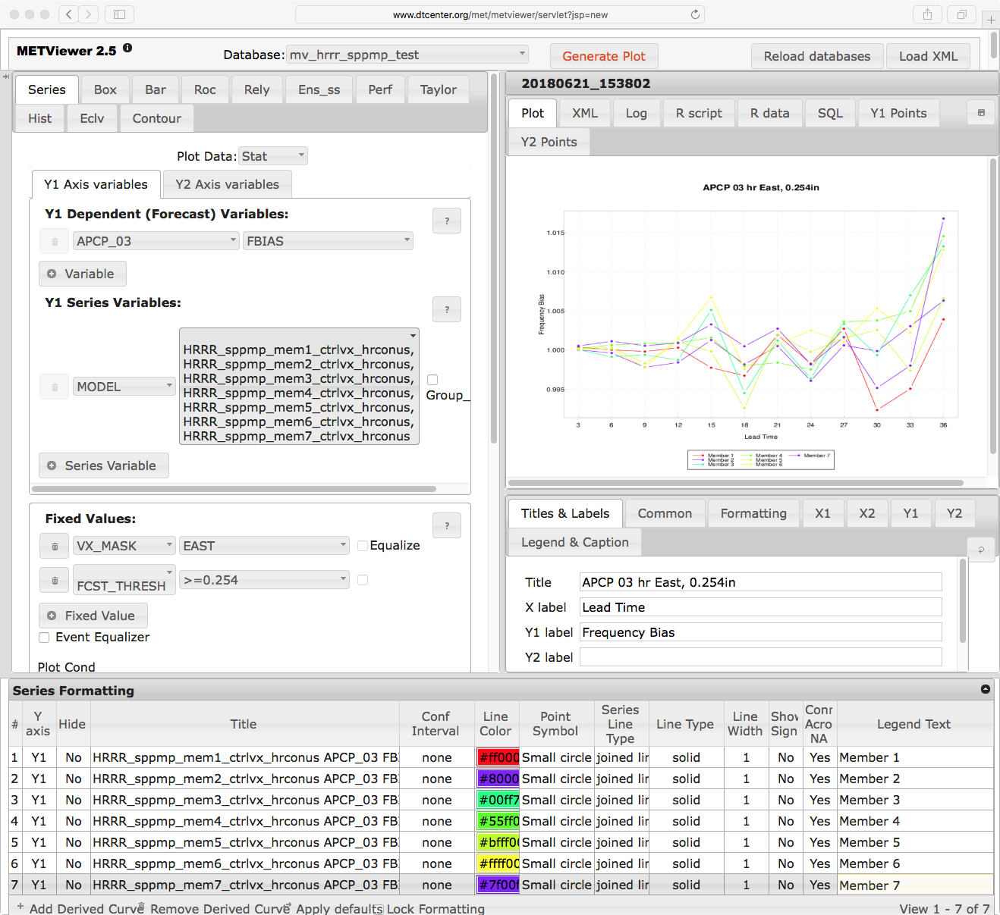

Series Plots
============

Description
-----------

The series plot is the most general of all the METviewer plotting options. A series plot is really just a special case of a scatter plot, where the dependent variable (i.e. Y-axis value) is related from one value to the next of the independent variable (X-axis value). Thus, points are placed into the graphic as on a scatter plot, but the Y-axis values are shown with connecting lines across the X-axis. Examples of data appropriate for this type of plot include verification statistics (on the Y-axis) for different lead times or thresholds (on the X-axis). The tremendous flexibility of this plot means that the user must specify many options. 

How-To
-------

Selection of options to produce the plot proceeds approximately counter-clockwise around the METviewer window. The steps to create a series plot are:

#. Select the desired database from the "Select databases" pulldown menu at the top margin of the METviewer window. 
   
#. There are a number of tabs just under the database pulldown menu. Select the 'Series' tab, which is the leftmost tab.

#. Select the type of MET statistics that will be used to create the series plot. Click on the “Plot Data” pulldown menu which is located under the tabs. The list contains “Stat”, “MODE”, or “MODE-TD”. For details about these types of output statistics in MET, please see the most recent version of the `MET User's Guide <https://dtcenter.org/community-code/model-evaluation-tools-met/documentation>`_.

#. Select the desired variable to calculate statistics for in the "Y1 Axis Variables" tab. The first pulldown menu in the  "Y1 Dependent (Forecast) Variables" section lists the variables available in the selected database.

#. Select the desired statistic to calculate in the second pulldown menu which is to the right of variable menu. This lists the available attribute statistics in the selected dataset. Multiple statistics can be selected and they will each be plotted as a separate line on the plot. 

#. Select the Y1 Series Variable from the first pulldown menu in that section. There are many options. "MODEL" is used in the included example. In the second pulldown menu to the right of the first are the series variable options, for example, different models.

#. It usually does not make sense to mix statistics for different groups. The desired group to calculate statistics over can be specified using the "Fixed Values" section. In the example below, a single domain (category: "VX_MASK", value: "EAST") and precipitation threshold value (category: "FCST_THRESH", value: ">=0.254") are chosen. If multiple domains or thresholds were chosen, the statistics would be a summary of all of those cases together, which may not always be desired. 

#. Select the x-axis value in the "Independent Variable" dropdown menu. For a series plot, this is often a date, lead time, or threshold. For a series plot, this variable must be continuous and there should be reason to believe that the statistic on the Y1 axis is connected across the values of the independent variable. If not, a scatter plot would be a more appropriate choice than the series plot. In the example in the next section, the Y1 dependent variable “Frequency Bias” is plotted for each of the “Y1 Series Variable” ensemble members. 

#. Select the type of statistics summary by selecting either "Summary" or "Aggregation Statistics" button in the “Statistics” section. Aggregated statistics may be selected for certain varieties of statistics. The selection can be made from the leftmost dropdown menu in the "Statistics" section. By default, the median value of all statistics will be plotted. Using the dropdown menu, the mean or sum may be selected instead. Choosing this option will cause a single statistic to be calculated from the individual database lines.

#. Now enough information has been entered to produce a graph. To do this, click the "Generate Plot" button at the top of the METviewer window (this is in red text). Typically, if a plot is not produced, it is because the database selected does not contain the correct type of data. Also, it is imperative to check the data used for the plot by selecting the "R data" tab on the righthand side, above the plot area. The data from the database that is being used to calculate the statistics is listed in this tab. This tab should be checked to avoid the accidental accumulation of inappropriate database lines. For example, it does not make sense to accumulate statistics over different domains, thresholds, models, etc. 

There are many other options for plots, but these are the basics. 

Example
--------

The image below shows an example of the plot and set-up options for a series plot in METviewer. This example uses the database “mv_hrrr_sppmp_test” to plot “Stat” output for seven ensemble members. The Frequency bias over the East domain is plotted for 3-hour precipitation accumulation exceeding 0.254 cm. Appropriate titles and labels have been entered in the titles and labels tab shown below the plot. Colors and line formatting are shown across the bottom menu of the plot. The values here are the defaults. 

	    Figure 3.1 Screen capture of METviewer configured to produce a series plot of frequency bias by lead time for 3-hour accumulated precipitation for seven ensemble members.

Here is the associated xml for this example. It can be copied into an empty file and saved to the desktop then uploaded into the system by clicking on the "Load XML" button in the upper-right corner of the GUI.  This XML can be downloaded by visiting GitHub here ??[insert link to XML]??. 

.. literalinclude:: xml/seriesplot_xml.xml
	    
