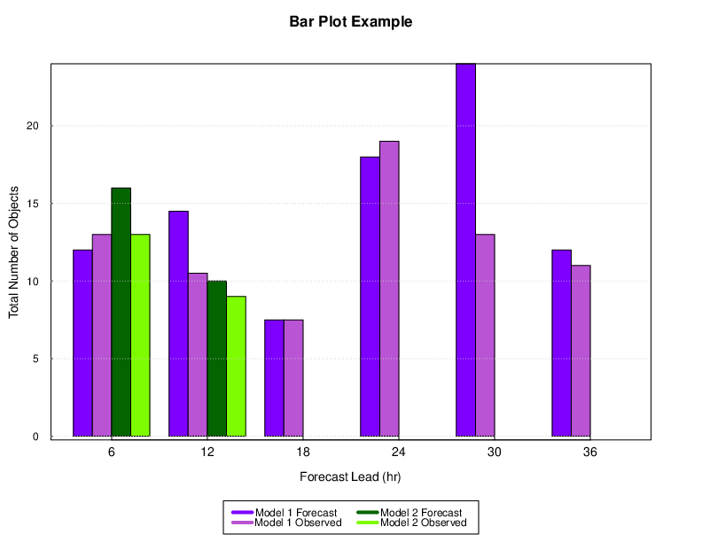

Bar Plots in METviewer
======================

Description
-----------

A bar plot shows comparisons among discrete categories. One axis of the chart shows the specific categories being compared, while the other represents some measured value. The heights or lengths are proportional to the values that they represent. Bar plots are simple and flexible, unlike some other METview plot types. Rather than using prescribed statistics in a specific way, the user can select both axes.

Bar plots are distinct from histograms and the two are not interchangeable. Histograms show the frequency of occurrence of values in discrete categories (that are sometimes created by binning continuous values). To create a histogram, the user may only select the variable for a single axis. In a bar plot, two axis values are selected by the user, one categorical and one numeric.

Details
-------

Bar plots often represent counts or frequencies. However, bar plots can represent means, medians, standard deviations, or any other statistic. 

Examples
--------

| The example below shows a bar plot.

Figure 4.1 Example Bar Plot created by METviewer.

