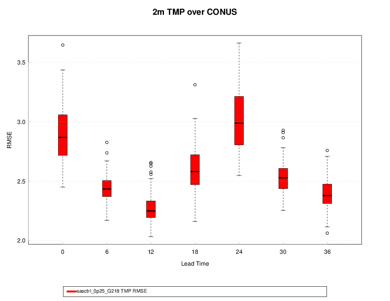

Chapter 5 Box Plots in METviewer
================================

5.1 Description
---------------

Boxplots, or box and whisker plots, are a way to summarize a distribution of values using Tukey's 5-number summary (Hoaglin et al, 1983). The dark line in the middle of the boxes (sometimes called the 'waist') is the median of data. Half of the data values have a value greater than the median, and half have a value lower. The actual box (i.e. the central rectangle) spans the first quartile to the third quartile (or the interquartile range or IQR). Whiskers extend to 1.5 times the height of the box or, if closer to the median, the minimum or maximum values of the data. The points represent outliers: any data point more than 1.5 times the IQR away from the median. These are defined as values that do not fall inside the whiskers. Outliers are extreme values.

5.2 Details
-----------

Boxplots work best for comparing a set of continuous values (e.g. some verification statistic) conditionally for a set of discrete categories. The example below shows RMSE (root-mean-squared-error; a continuous measure of forecast quality) for each of several distinct lead times. Other examples could be probability of detection (POD) or Gilbert Skill Score (GSS) across a set of models for a specific precipitation threshold. Here, each forecast and observation is binary, but the verification statistic is continuous. 

5.3 Examples
------------

The example below shows a boxplot of the RMSE for 2m temperature over the CONUS. Many of the standard METviewer plotting options are available for the boxplot. However, the boxplot has some special options than only apply.

	    Figure 5.1: Example Boxplot created by METviewer for RMSE of 2m temperature over the CONUS by lead time.
