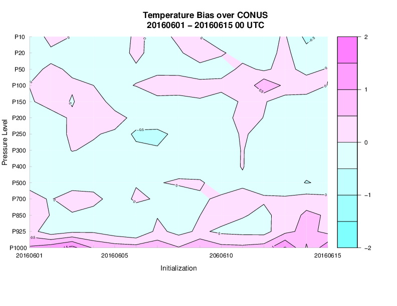

Contour Plots in METviewer
==========================

Description
-----------

Contour plots are a very general plot type somewhat similar to a scatter plot. The axes are specified by the user, and any will do so long as the entire set of x and y locations has some value (i.e. not missing data). The value is then contoured. This type of plot is often used to examine statistics over a series of time or heights. Often, it can be desirable to examine the difference in statistics between two NWP models as a contour plot, as is shown in the example below. 

Details
-------

Selection of options to produce your plot proceeds approxately counter-clockwise around the METviewer window. Select your database from the pulldown menus at the top margin of the METviewer window. Make sure the 'Series' tab is selected near the top left, just under the database pulldown menu. Next, you must select the type of MET statistics that will be used to create the plot. In the “Plot Data” menu, the list contains “Stat”, “MODE”, or “MODE-TD”. For details about these types of output statistics in MET, please see the most recent version of the MET Users' Guide (www.dtcenter.org/met/users/docs).

Generate Plot button at top of METviewer window with the red text. 

Examples
--------

The primary goal

	    Figure 10.1:  Example METviewer contour plot showing temperature bias by pressure level over a series of initialization times.

Several optional plotting utilities are provided to assist users in checking their output from the data preprocessing step.

.. figure:: temp_bias_difference_contour.png

	    Figure 10.2:  Example METviewer contour plot showing the differences in temperature bias by pressure level for two models over a series of initialization times.
