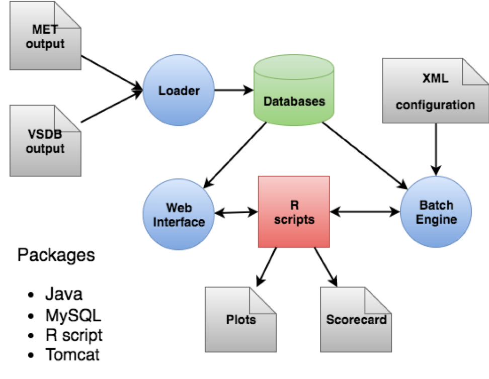

Chapter 1 Overview of METviewer
===============================

1.1 Purpose and organization of the User's Guide
------------------------------------------------

The goal of this User's Guide is to provide basic information for users of the METviewer database and display system to enable users to create plots from their MET output statistics. 

The METviewer User's Guide is organized as follows.

1.2 The Developmental Testbed Center (DTC)
------------------------------------------

METviewer has been developed, and will be maintained and enhanced, by the Developmental Testbed Center (DTC; http://www.dtcenter.org/ ). The main goal of the DTC is to serve as a bridge between operations and research, to facilitate the activities of these two important components of the numerical weather prediction (NWP) community. The DTC provides an environment that is functionally equivalent to the operational environment in which the research community can test model enhancements; the operational community benefits from DTC testing and evaluation of models before new models are implemented operationally. METviewer serves both the research and operational communities in this way - offering capabilities for researchers to test their own enhancements to models and providing a capability for the DTC to evaluate the strengths and weaknesses of advances in NWP prior to operational implementation.

The METviewer package will also be available to DTC visitors and to the modeling community for testing and evaluation of new model capabilities, applications in new environments, and so on.

1.3 METviewer goals and design philosophy
-----------------------------------------

The METviewer tool reads MET verification statistics output from a database and creates plots using the R statistical package. The tool includes a web application that can be accessed from a web browser to create a single plot. The specification for each plot is built using a series of controls which are then serialized into XML. The controls are found in the left half, lower panel, and lower right quadrant of the METviewer browser. Details about these controls are found in :ref:`userspec`. For each plot, METviewer generates output in the form of a SQL query, an R script to create the plot, a flat file containing the data that will be plotted and the plot itself. This output populates the upper right quadrant of the METviewer database. 

The METviewer code and documentation is maintained by the DTC in Boulder, Colorado. The MET package is freely available to the modeling, verification, and operational communities, including universities, governments, the private sector, and operational modeling and prediction centers.

1.4 METviewer Requirements
--------------------------

METviewer requires installation of Java, Apache / Tomcat, MySQL, and R statistics.

	    
	    Figure 1.1 METviewer flowchart, showing types if input data, output types, and options for use. 

.. _userspec:

1.5 METviewer User Specifications
---------------------------------

The top menu allows the user to select a database and type for the plot. 

The first section is where the dependable variable (Y-axis) , statistic of interest, and series variables of interest are selected The Y2 axis can be used to plot a Base Rate.

The fixed variables section controls the constraints for the plot (what period of data is used, what thresholds to include, interpolation method, as well as domains). Fixed values are your stratifications. For example, select one or more thresholds to be aggregated, or one or more initilization times, or a date range based on valid times or cycle time.

Each of the above selections can have one or multiple items. To add variables, series, or fixed values, select the button with the '+' directly below the desired item. Then additional selections will appear in a new dropdown menu. To delete these extras, select the trash icon to the left of the item. 

The independent variable section is where the X-axis is configured. As an example, forecast lead hour often serves as the x-axis for a series plot.

This section is reserved for line labels and formatting for the individual series confidence intervals: Normal Bootstrap Standard error (median or mean) – configurable 

Summary – scores computed per each combination of fixed values and independent variable then mean or median taken. 

Aggregate statistics – accumulates SL1L2 lines or CTC counts prior to calculating the statistics.

Revision statistics - Creates a revision series (e.g. the temporal change in a statistic). 

Confidence intervals - METviewer supports two statistical derivation methods... (1) plot the mean of the daily stats with confidence intervals defined by the "standard error"... that uses the standard deviation to add confidence intervals and assumes normality (2) plot the aggregated statistics with confidence intervals defined by bootstrapping that aggregation

??This is a note in lyx:  This is some text from a MET help question. It needs to be edited, but it covers a lot of the details:??

To test, I tried method (1) and it works fine for some of the categorical stats, like BASER and FMEAN. However, applying it to GSS results in this error:

==== Start Rscript error ==== Error in if (0 < sum(listDataInd)) { : missing value where TRUE/FALSE needed Execution halted ==== End Rscript error ====

For high thresholds, GSS is undefined and that missing data is causing this error message. When I restrict the plot to the 2 lowest thresholds for which there are always events, then method (1) works fine.

But you asked about method (2). Here are the details for applying bootstrap confidence intervals... - In the "Statistics" box make sure you have "Aggregation Statistics" selected... and you do. - In the "Statistics" box in the dropdown menu select the line type to be aggregated. For GSS, you aggregate CTC lines, which is what you have selected. - In the "Statistics" box select the number of bootstrapping replicates, using in general, at least 1000. I changed your "1" to "1000". - Note that if you want to make your plot exactly repeatable in subsequent runs, set the boostrapping seed to any number. - In the "Series Formatting" table in the "Conf Interval" column, select "boot".

Some other suggestions... - The default alpha value is 0.05 for 95% confidence interval. You can change that in the "Common" tab. Setting alpha = 0.01 would yield a 99% CI. - On the "Common" tab, select "Y1 Stagger Points". That prevents the CI bars from being plotted on top of each other.

Bootstrapping 1000 times takes longer to generate the plot.

To really compare the difference of these lines, I'd suggest plotting their pairwise difference:

- In the bottom-left corner, select "+Add Derived Curve". - In the pop-up, choose GFS in the first box and FV3GFS in the second, make sure "DIFF" is selected, and click "Create Derived Curve". - We now have a new entry in the "Series Formatting" table. Select "boot" in the "Conf Interval" column. Change the color to black and line width to 3. And set "Show Significance" to Yes. - In "Series Formatting" set the "Legend Text" to FV3GFS, GFS, and GFS-FV3GFS. - In the "Y1" tab get rid of the "Y1 Limits" setting so that R can fit all the data on the plot. - In the "Formatting" tab, set the "Plot Script Commands" to draw a gray dashed reference line at 0: abline(h=0,col="gray",lty=2,lwd=3)

This shows that at GFS has a statistically significant higher GSS score than FV3GFS at the lowest threshold. But the results are not statistically significant at higher thresholds. Visually, when the confidence interval for the pairwise difference line does not include 0, the difference is significant and METviewer plots the CI in bold. That's the effect of turning on "Show Significance".

1.6 METviewer Output
--------------------

METviewer output all appears in the tabbed boxes at the top right quadrant of the web browser. The plot will show by default, but the user can click any of the tabs along the top to see the other windows. The tabs include:

XML - This window contains all the code to reproduce the plot. It is recommended that the user save it. It can be reloaded using the 'Load XML' button at the top right of the METviewer web page.

Log - Contains some runtime information regarding input data, run time, and which scripts were called.

R script - Contains the R code used to organize the data and create the plot. This can be easily modified directly by the user to create slightly different plots for alternate purposes.

R data - It is essential that all users look at the contents of this tab. Contained here is the data used to create the plot. Users should check to see if it is correct. Often, a user with limited knowledge of the database may select data in such a way as to combine information in an unintended way. For example, statistics for different event thresholds should not be combined, but if the user fails to select the threshold(s) correctly in the 'fixed values' section of METviewer, the plot will show statistics for the combined data. 

SQL - This tab contains the SQL code used to gather the data for the plot.

Y1 Points - This tab will be blank for several of the plot types. 

Y2 Points - See above.

The rightmost tab is a small square. Clicking here will save the contents of the current window to your default (usually 'Downloads') folder. It is recommended that the user click through at least the plot and xml windows and save this output.

1.7 METviewer Plot Formatting Specifications
--------------------------------------------

METviewer plot formatting options appear in the tabbed boxes at the bottom right quadrant of the web browser. The “Titles & Labels” tab will show by default, but the user can click any of the tabs along the top to see the other windows. The tabs include:

Titles and Labels: This menu contains boxes for the user to specify a plot title, caption, and axis labels.

Common: This tab contains ten check boxes and a confidence level specification box. The ten check boxes add axes, stagger points from different axes, add sample sizes or statistics text to the plots. 

Formatting: Plot, title and grid formatting options are available here. Options include image type, height, width, and resolution. Margins, offsets, text size, line widths, etc. can all be set in units of text point size (e.g. 8 = 8 pt font)

X1, X2, Y1, and Y2 - These tabs specify the axis labels and values. The text size, weight, alignment and offset can be chosen. For Y1 and Y2 axes, limits and buffers can also be set. 

Legend & Caption: Options for the Legend and Caption include text size, position, alignment, color, offset. For details about setting these specifications, see the R-help pages for the functions “legend” and / or “title”. 

Reset: This button, shown to the far right with a circular arrow icon, will reset all options to the defaults.

1.8 METviewer Series Formatting Specifications
----------------------------------------------

At the bottom of the METviewer window is the series formatting box. It allows the user to control the minute details of each line on a plot, including title, color, symbol, line type, line width, legend text.

Four radio buttons along the bottom of this menu allow users to create a derived curve or remove one, apply default values or lock the formatting in place (so subsequent plots are identical in format). 

1.9 METviewer History Menu
--------------------------

Along the left of the METviewer GUI, hidden by default, is the history menu. To open this menu, click the arrow at the top left side right underneath the “METviewer 2.6” label. This menu provides a list of all (or all successful) recent plotting attempts using the METviewer GUI. Users can select items from this menu to recover plots they may have neglected to save. Clicking on the button showing loads the plot. 

1.10 Future development plans
-----------------------------

METviewer is an evolving verification database and display software package. New capabilities are planned in controlled, successive version releases. Bug fixes and user-identified problems will be addressed as they are found. Plans are also in place to incorporate many new capabilities and options in future releases of METviewer. Additionally, updates to accommodate new features of the MET software are often required. 

1.11 Code support
-----------------

METviewer support is provided through a MET-help e-mail address: met_help@ucar.edu. We will endeavor to respond to requests for help in a timely fashion. 

We welcome comments and suggestions for improvements to METviewer, especially information regarding errors. Comments may be submitted using the MET Feedback form available on the MET website. In addition, comments on this document would be greatly appreciated. While we cannot promise to incorporate all suggested changes, we will certainly take all suggestions into consideration.

METviewer is a "living" application. Our goal is to continually enhance it and add to its capabilities. 
