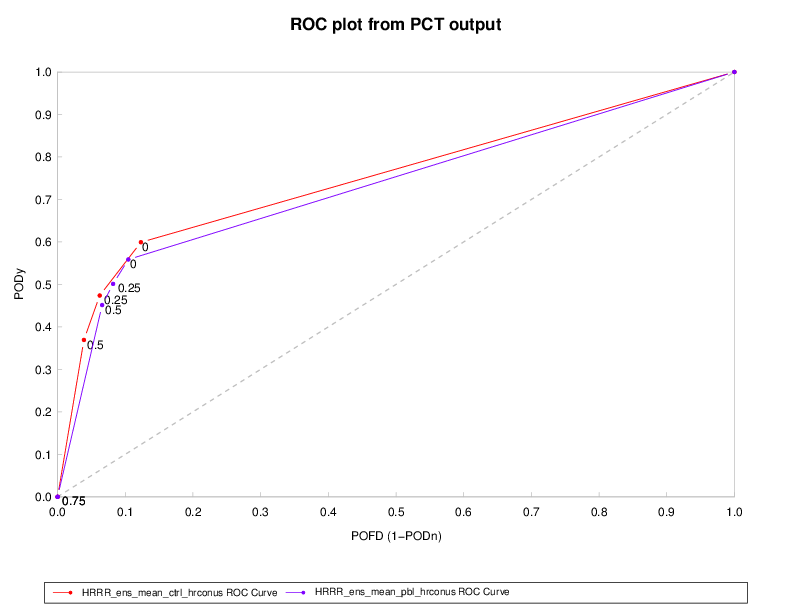

Receiver Operating Characteristic (ROC) Plots in METviewer
==========================================================

Description
-----------

MET produces hit rate (POD) and probability of false detection (POFD) values for each user-specied threshold of a forecast, or from each category of a probabilistic forecast. This information can be used to create a scatter plot of POFD vs. POD. When the points are connected, the plot is generally referred to as the receiver operating characteristic (ROC) curve (also called the "relative operating characteristic" curve). An ROC plot is shown for an example set of forecasts, with a solid line connecting the points for six user specified thresholds. The diagonal dashed line indicates no skill while the dash-dot line shows the ROC for a perfect forecast. An ROC curve shows how well the forecast discriminates between two outcomes, so it is a measure of resolution. The ROC is invariant to linear transformations of the forecast, and is thus unaffected by bias. An unbiased (i.e., well-calibrated) forecast can have the same ROC as a biased forecast, though most would agree that an unbiased forecast is "better". Since the ROC is conditioned on the observations, it is often paired with the reliability diagram, which is conditioned on the forecasts.

Details
-------

Selection of options to produce your plot proceeds approxately counter-clockwise around the METviewer window. Select your database from the pulldown menus at the top margin of the METviewer window. Make sure the ROC tab is selected near the top left, just under the database pulldown menu. Next, you must choose the “Stat” option in the “Plot Data” menu, as this type of diagram can only use information from the CTC and PCT line types available in the “Stat” output. For details about these types of statistics from MET, please see the most recent version of the MET Users' Guide (www.dtcenter.org/met/users/docs). The method for creating the plot from each type of data is included below:

(1) The most common way to product an ROC plot is using the Nx2 Probabilistic Contingency Table counts from the PCT line in MET. MET can also write out the PSTD line type which includes the ROC_AUC column: a number between 0 and 1 indicating the area under the ROC curve, with 1 being the best. MET calculates this value and it gets loaded into METviewer. METviewer can plot the ROC_AUC value but it does not compute it.

(2) The less common way of generating a ROC curve is using several 2x2 contingency table lines. This would be the FHO or CTC line types from MET. They need to be multiple forecast thresholds all computed for the *same* observation threshold. However, METviewer does not currently compute the area under the ROC curve, thus there is no way for METviewer to plot that statistic.

In both of the above cases, the observation threshold must be identical for all points on the plot. Otherwise, this is not an ROC plot at all. 

Examples
--------

The plot shown below is for two different probability of precipitation forecasts. The dashed diagonal line represents the no-skill line. Idea forecasts would have a point at the top left of the graphic, thus better forecasts are closer to the top left of the plot. In this example, the red line is closer than the purple line to ideal. However, this small difference is probably not statistically significant. 

	    Figure 6.1: Example ROC diagram showing POD vs. POFD for two different POP forecasts at thresholds of (0%, 25%, 50%, and 75%).
