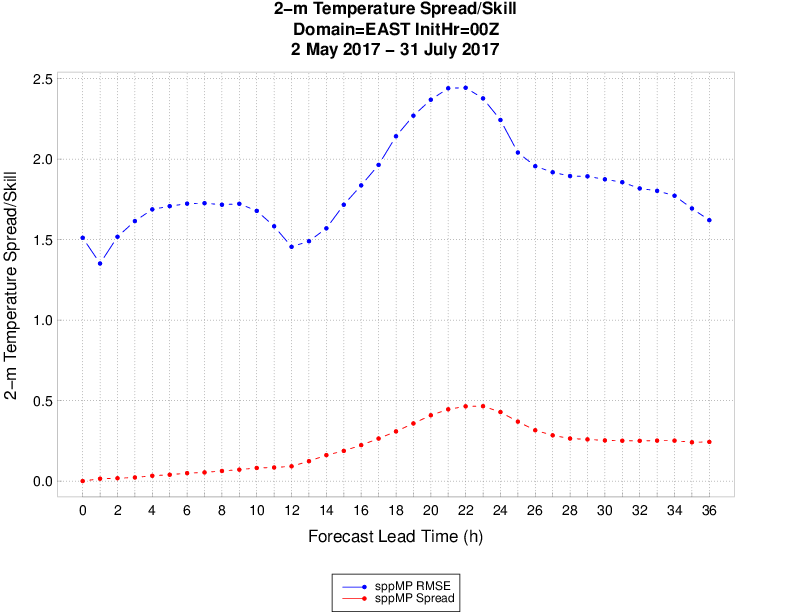

Spread vs. Skill Plots in METviewer
===================================

Description
-----------

Spread vs. Skill plots are widely used to evaluate the quality of ensemble forecasting systems. One goal of ensemble forecasting is to have the ensemble members represent the range of possible outcomes, which suggests that the ensemble spread shoud approsimately equal the skill of the ensemble mean (as measured by RMSE). Spread and skill will be plotted on the y-axis, and the user may select the x axis variable. 

Details
-------

Selection of options to produce your plot proceeds approxately counter-clockwise around the METviewer window. Select your database from the pulldown menus at the top margin of the METviewer window. Make sure the 'Series' tab is selected near the top left, just under the database pulldown menu. Next, you must select the type of MET statistics that will be used to create the plot. In the “Plot Data” menu, the list contains “Stat”, “MODE”, or “MODE-TD”. For details about these types of output statistics in MET, please see the most recent version of the MET Users' Guide (www.dtcenter.org/met/users/docs).

Generate Plot button at top of METviewer window with the red text. 

Examples
--------

The primary goal ??More detail please??

	    
	    Figure 11.1 Example METViewer Spread vs. Skill plot showing temperature RMSE and Spread for a series of forecast lead times.
	   
Several optional plotting utilities are provided to assist users in checking their output from the data preprocessing step. 
